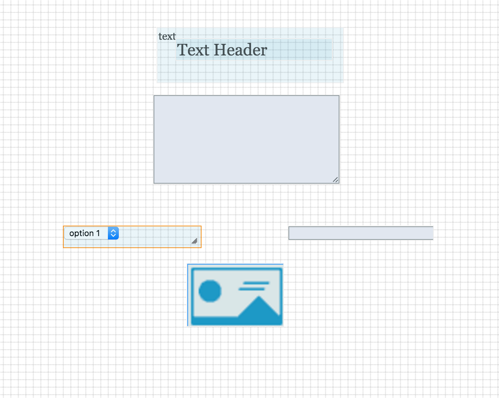

# project2CitiBike

Using the list of Citi bike locations in NYC from NYC Open Data the user will be able to do the following. 

1: Create a user name 

2: Search or select bike stations

3: List how many bikes are available at the selected station 

4: Show the bike stations on google maps

