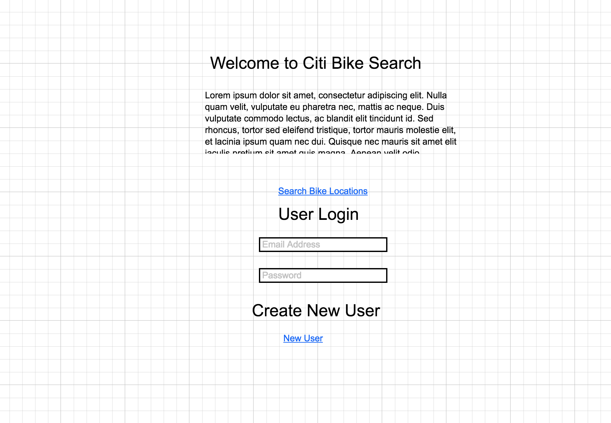
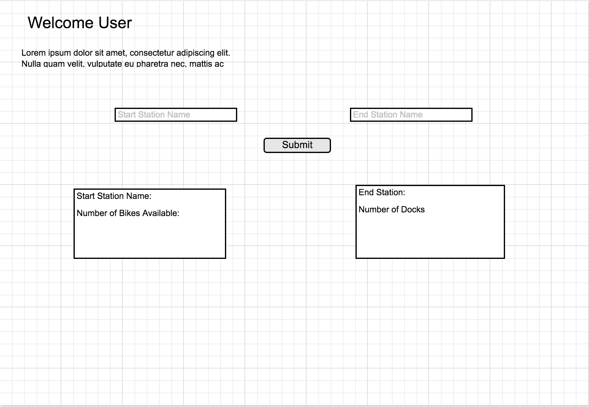
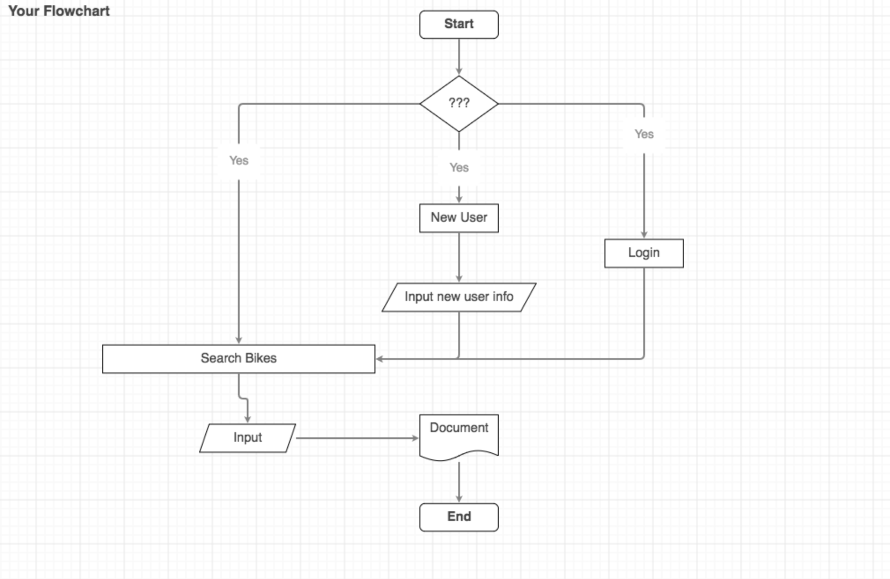

# project2CitiBike

As a user the user will be able to request the number of Citi Bikes available per location. So if the user wanted to know how many bikes are available at the W 52nd location, the user can see the number of bikes in the dock.

Also, the user can check if the destination station has available docks available. So if the user's destination is Atlantic & Furman Street location, the user can see the number of docks available.

Currently the search function populates all Citi Bike locations, bikes available, and docks available. 

The user can sign up and sign in but can not save any bike locations or search specific bike locations. In the future the user should be able to save bike station stations and search specific stations.

Home Page:
The user can go to the search bikes, login, or create a new user ID and password.

Search Page:
The user will be able to search all the bike stations with the number of available bikes and docks.

Flowchart:

